# Project Title: SecureGuard Program for North Coast Analytics

# SecureGuard Program for North Coast Analytics

**Company:** North Coast Analytics (NCA)  
**Industry:** Data analytics and cloud services  
**Employees:** 550  
**Locations:** Portland, Oregon (headquarters); data center facility in Hillsboro, Oregon; fully remote workforce across the United States  
**Primary Assets:** Proprietary customer datasets, machine learning models, cloud infrastructure, internal research.

---

## Section 1: Executive Summary

North Coast Analytics provides predictive analytics and data warehousing for mid-sized logistics firms. With 550 employees and clients in 12 states, NCA processes over 2 petabytes of sensitive operational data. Threats include ransomware, credential theft, and insider data exfiltration. Business drivers for a formal security program: recent insurance premium increases, a client-required SOC 2 report, and two near-miss phishing incidents. The SecureGuard Program will implement Zero Trust, 24/7 monitoring, and compliance with the NIST Cybersecurity Framework.

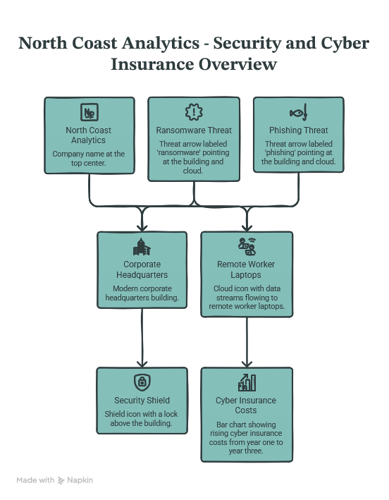

---

## Section 2: Asset Inventory and Classification

All assets are inventoried in an asset management database. Data assets include customer operational data (Confidential), NCA internal financials (Restricted), and marketing materials (Public). System assets: 450 employee laptops (Dell Latitude), 40 build servers, 120 cloud workloads (compute and storage), 15 network switches, 6 firewalls, 2 HSMs. People assets: 550 employees (including 50 contractors). Facility assets: Portland HQ (three floors), Hillsboro data center (one server room). Classification matrix: Public (external marketing), Internal (non-sensitive policies), Confidential (customer data, models), Restricted (SSH keys, board reports).

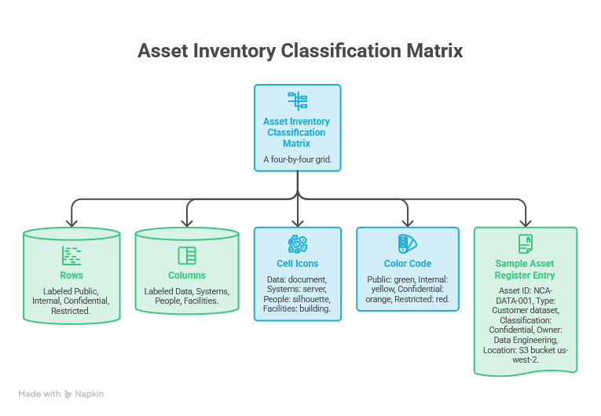

---

## Section 3: Risk Assessment

Qualitative risk assessment across 15 risk items. Top five risks: 1) Credential phishing leading to cloud console access (Likelihood: High, Impact: High). 2) Unpatched third-party analytics library (Likelihood: Medium, Impact: High). 3) Insider deleting customer data (Likelihood: Low, Impact: Critical). 4) Ransomware on employee laptop spreading via SMB (Likelihood: Medium, Impact: High). 5) Loss of encryption keys (Likelihood: Low, Impact: Critical). Mitigations include mandatory MFA, weekly patch scans, immutable backups, and HSM key storage. Risk register includes columns: Risk ID, Description, Likelihood (1-5), Impact (1-5), Risk Score, Owner, Mitigation Status.

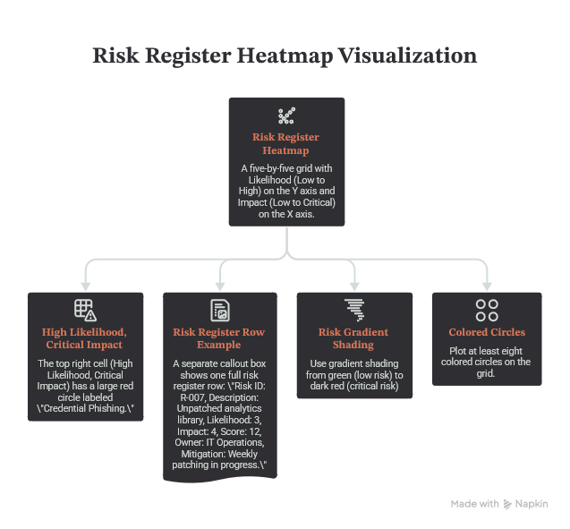

---

## Section 4: Security Architecture and Network Design

Zero Trust model with no implicit trust. Network segmented into four core VLANs: VLAN 10 Production (customer data processing), VLAN 20 Development (engineering sandbox), VLAN 30 Corporate (employee workstations and printers), VLAN 40 Guest (visitor Wi-Fi). Additional management VLAN 99 for network devices. Point-to-point VPN using WireGuard between Portland HQ and Hillsboro data center. Cloud architecture using Stratos Cloud (invented AWS alternative) with VPC segmentation, security groups, and a cloud-native WAF. Encryption: TLS 1.3 for all data in transit, AES-256-GCM for data at rest. Key management: on-premises Luna HSM for restricted keys, Stratos KMS for cloud keys. Control mapping to NIST 800-53 Rev 5: AC-3 (access enforcement), SC-13 (cryptography), CA-3 (information sharing).

**Full network diagram details:**

- Portland HQ: One edge firewall (brand: NetGuard X9) with two WAN links (primary fiber 1 Gbps, backup LTE). Behind firewall: core switch (48-port, stackable) with 802.1Q trunk ports. Connected to core switch: four access switches (24-port PoE) for office floor drops. Also connected: a wireless controller managing six access points.
- Hillsboro data center: Identical edge firewall. Core switch connects to 20 physical servers (each with dual 10GbE NICs) and two storage arrays (each 500 TB usable).
- Point-to-point VPN: IPsec tunnel between NetGuard X9 firewalls with 256-bit AES. Tunnel subnet 10.255.255.0/30.
- VLANs detailed:
  - VLAN 10 Production: Subnet 10.10.0.0/16, gateway 10.10.0.1. Contains database servers (10.10.1.0/24) and analytics compute (10.10.2.0/24).
  - VLAN 20 Development: Subnet 10.20.0.0/16, gateway 10.20.0.1. Contains GitLab, build agents, staging.
  - VLAN 30 Corporate: Subnet 10.30.0.0/16, gateway 10.30.0.1. DHCP range 10.30.100.0-10.30.200.0 for employee laptops.
  - VLAN 40 Guest: Subnet 172.16.40.0/24, gateway 172.16.40.1. Client isolation enabled, outbound only to internet.
  - VLAN 99 Management: Subnet 192.168.99.0/24, gateway 192.168.99.1. Access restricted to jump host.
- Cloud architecture: Stratos Cloud region US-West. Single VPC with four subnets: web tier (public, load balancer only), app tier (private), data tier (private), management tier (private, bastion host). Security groups allow only necessary ports: 443 from internet to web tier, 8080 from web to app, 5432 from app to data.

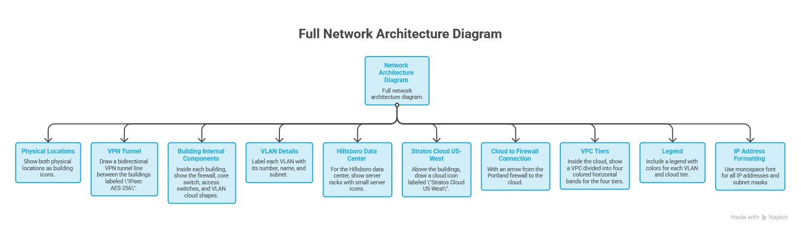

---

## Section 5: Identity and Access Management Program

MFA required for all 550 users using TOTP. RBAC roles: Analyst (read-only customer data), Engineer (modify models, no production deploy), Administrator (full infrastructure), Executive (reports and approvals). SSO via VeriID (invented identity provider) integrated with all SaaS applications. PAM using PrivGuard (invented) for session recording and just-in-time admin access. Joiner-Mover-Leaver process: HR system triggers user creation within 2 hours; role changes require manager approval; leaver account disabled within 1 hour.

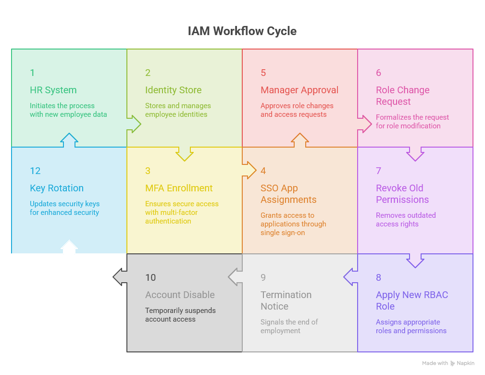

---

## Section 6: Security Operations Program

SIEM using LogStream 9000 (invented Splunk alternative) ingesting 500 GB per day. SOC operates on follow-the-sun model: internal team 8am-8pm Pacific, third-party overnight monitoring. Log retention policy: 30 days hot, 90 days warm, 365 days cold on archival storage. Incident Response Plan (IRP) covers six phases: Preparation, Detection, Containment, Eradication, Recovery, Post-Mortem. SOC runbooks for phishing, ransomware, and data exfiltration. Threat intelligence feed from SecurIntel (invented) integrated into SIEM.

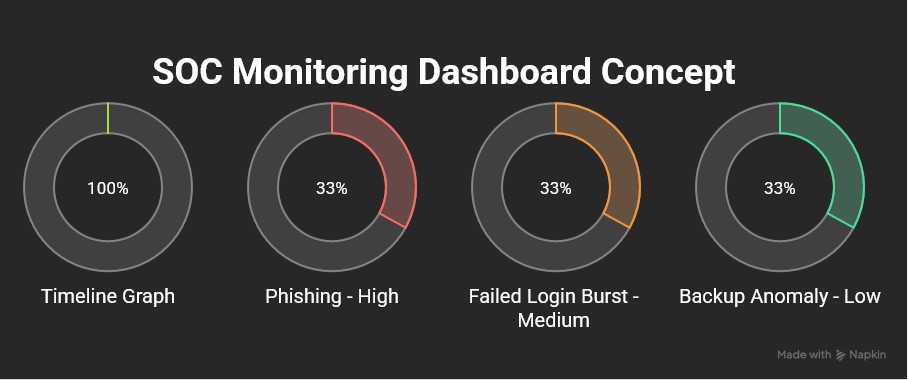

---

## Section 7: Business Continuity and Disaster Recovery

Business Impact Analysis identified three priority processes: customer data ingestion (RTO 4 hours, RPO 15 minutes), model training (RTO 24 hours, RPO 1 hour), internal payroll (RTO 48 hours, RPO 24 hours). Backup strategy follows 3-2-1 rule: three copies, two media types (SSD and tape), one off-site. Daily backups to primary disk, weekly backups to encrypted tape stored in a third-party vault. DR site design: cold standby at a colocation facility in Seattle with replicated infrastructure configuration but no live data. Tabletop exercise plan: twice yearly, scenario of ransomware encrypting primary data center.

 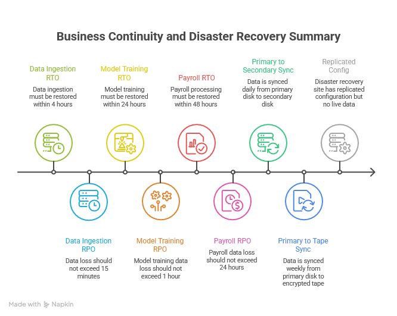

---

## Section 8: Security Policies and Governance

Complete set of 12 formal policies. Named policies: Acceptable Use (AUP-001), Access Control (ACP-002), Data Classification (DCP-003), Incident Response (IRP-004), Change Management (CMP-005), Vendor Risk Management (VRP-006), Secure SDLC (SSP-007), Password Policy (PWP-008), Remote Access (RAP-009), Asset Management (AMP-010), Business Continuity (BCP-011), Sanctions and Termination (STP-012). All policies reviewed annually by the Security Council (CISO, CTO, Head of HR). SSDLC includes mandatory SAST (static analysis) and DAST (dynamic analysis) before production deployment.

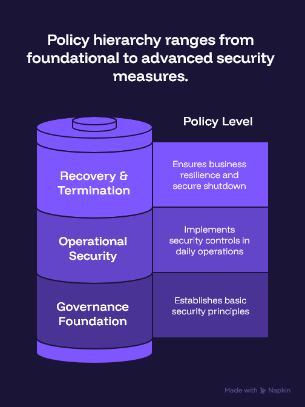

---

## Section 9: Compliance and Legal Requirements

Framework mapping to NIST CSF (Tier 3 - Repeatable). ISO 27001 gap analysis shows 12 of 114 controls missing. SOC 2 Type I readiness achieved in Q2. HIPAA not applicable (no ePHI). Oregon Consumer Privacy Act (OCPA) and California Consumer Privacy Act (CCPA) apply due to data subjects in both states. Compliance roadmap: Q3 complete ISO 27001 Statement of Applicability, Q4 SOC 2 Type II audit, Q1 next year OCPA gap remediation. Gap analysis format: Control ID, Framework, Current State (Present/Partial/Absent), Remediation Action, Owner, Due Date.

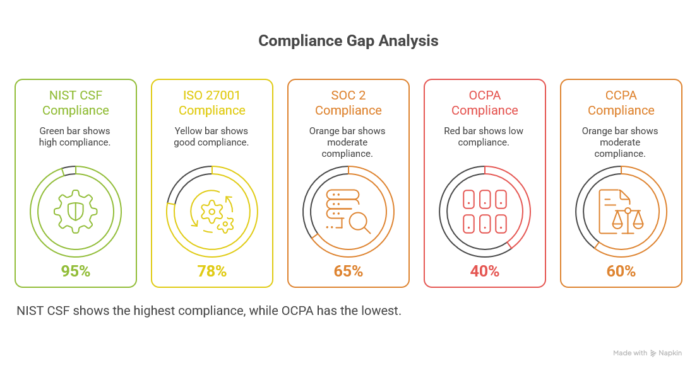

---

## Section 10: Security Awareness and Training Program

Annual training for all 550 employees via LMS. Topics: phishing, password hygiene, tailgating, clean desk. Phishing simulations monthly: 10 percent of workforce each month, with remedial training for clickers. Role-based training: administrators (PAM, backup recovery), developers (OWASP Top 10, SAST/DAST), executives (breach communication, legal risk). Sample materials: one-page infographic on phishing red flags, five-question quiz for annual training.

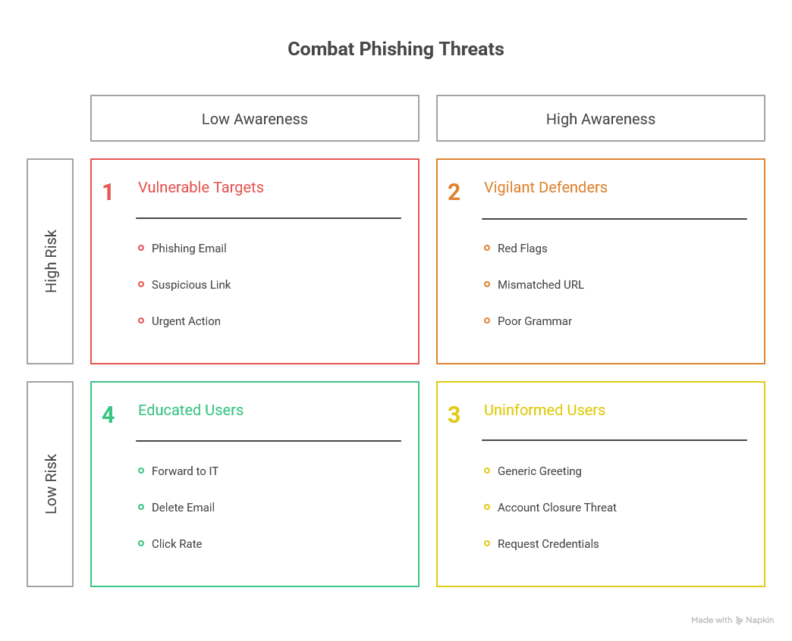

---

## Section 11: Final Presentation and Executive Report

A 14-slide executive presentation. Slide titles: 1) Title, 2) Executive Summary, 3) Top 5 Risks, 4) Asset Landscape, 5) Zero Trust Architecture Overview, 6) IAM Summary, 7) SOC Capabilities, 8) BCP/DR at a Glance, 9) Policy Framework, 10) Compliance Roadmap, 11) Training Plan, 12) Budget Estimate (year one: 2.4 million dollars), 13) 12-Month Roadmap (Gantt chart), 14) Recommendations. Budget breakdown: 800k for tools (SIEM, PAM, HSM), 600k for services (SOC retainer, consulting), 500k for staffing (two security engineers), 300k for training and simulations, 200k for DR site colocation. 12-month roadmap shows months 1-3: asset inventory, policies, IAM rollout; months 4-6: SIEM deployment, network segmentation; months 7-9: SOC go-live, first tabletops; months 10-12: compliance audits, full program review.

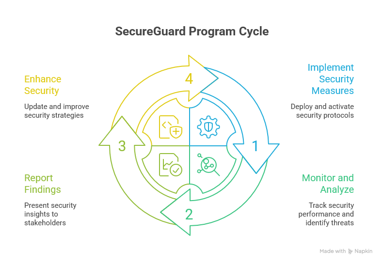

---

## Project Summary

| Section | Title |
|---------|-------|
| 1 | Executive Summary |
| 2 | Asset Inventory and Classification |
| 3 | Risk Assessment |
| 4 | Security Architecture and Network Design |
| 5 | Identity and Access Management Program |
| 6 | Security Operations Program |
| 7 | Business Continuity and Disaster Recovery |
| 8 | Security Policies and Governance |
| 9 | Compliance and Legal Requirements |
| 10 | Security Awareness and Training Program |
| 11 | Final Presentation and Executive Report |
